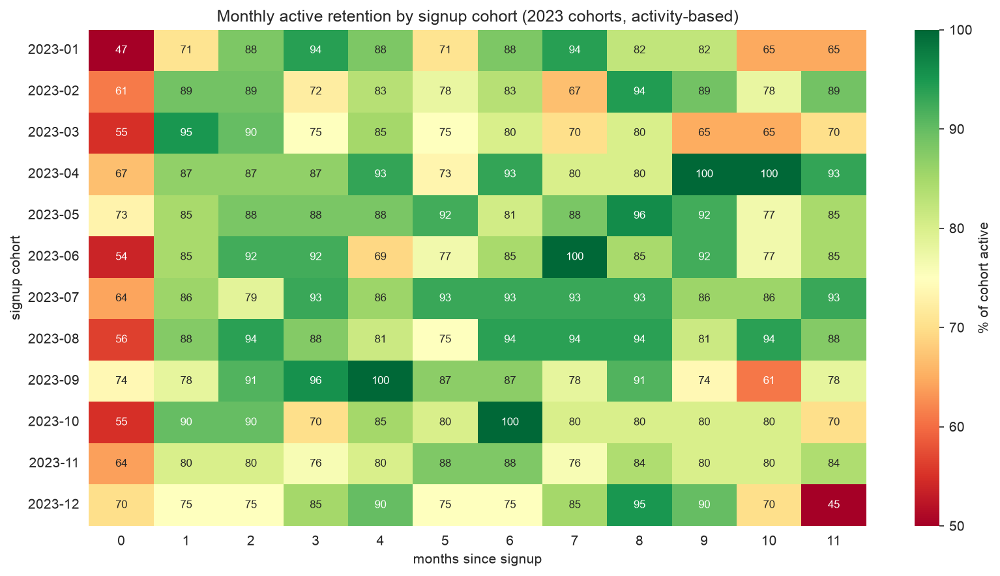
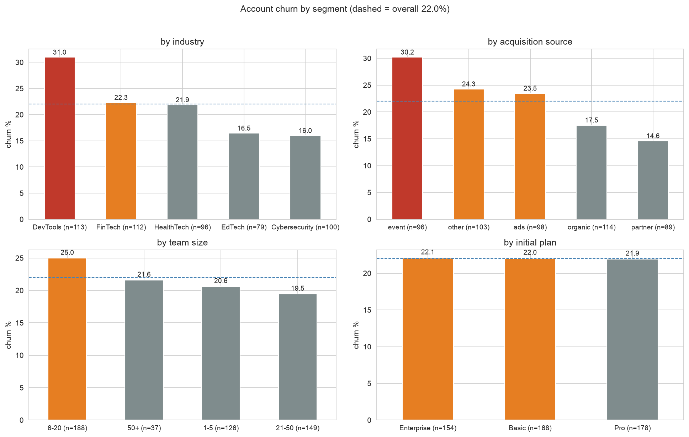

# RavenStack — Growth & Retention Analysis

## Overview

- PM analytics case study for a synthetic B2B SaaS product
- Dataset: 500 accounts, 5k subscriptions, 25k usage events, 2k tickets, 600 churn events
- Goal: identify where retention breaks, what it costs, and what to test next

## Key Findings

- **Account churn:** 22.0% (110/500)
- **Highest-risk segments:** DevTools 31.0%; event-sourced 30.2% vs partner 14.6%; 6–20 seats 25.0%
- **Usage/support:** weak churn signals. No pre-churn usage dip; CSAT and response times are basically flat
- **Reasons:** features 19.0% (#1, especially Enterprise); budget + support 17.3% each
- **Revenue:** $14.15M ARR on churned subscriptions; Enterprise = 78.6% ($11.12M)
- **Cohorts:** event accounts diverge around M6, not during onboarding
- **Activation:** no useful first-30d feature-breadth threshold found

## Recommendation

1. Run an Enterprise feature-fit discovery loop: churn interviews + a structured exit survey
2. Test value checkpoints for event-acquired accounts in months 4–6

Full decision, assumptions, metrics and experiment design: [`product/product_recommendation_memo.pdf`](product/product_recommendation_memo.pdf)

## Outputs

- `analysis/` — SQL, metric definitions, Tableau extract builder
- `notebooks/product_analysis.ipynb` — exploration + statistical checks
- `dashboard/ravenstack_dashboard.twbx` — Tableau workbook, 4 tabs
- `images/` — exported charts

## Data Notes

- Account churn, subscription churn and churn events are different metrics; definitions are in [`analysis/README.md`](analysis/README.md)
- 53% of usage events predate signup. All usage metrics are bounded to signup → churn
- Synthetic data: methodology is the point, not the absolute numbers

Dataset credit: River @ Rivalytics, [RavenStack SaaS Subscription & Churn Analytics](https://www.kaggle.com/datasets/rivalytics/saas-subscription-and-churn-analytics-dataset)
